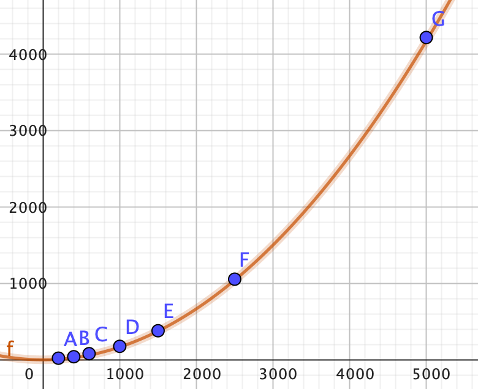

# Série 2, exercice 3

A l'aide du programme WhatComplexity, déterminer la complexité de l'algorithme
Algo 1 en sachant qu'il est de complexité $O(n)$, $O(n^2)$, ou bien $O(n^3)$.

## Algo 1

| count | value |
|:------|------:|
| 200   | 0.021 |
| 400   | 0.040 |
| 600   | 0.076 |
| 800   | 0.120 |
| 1000  | 0.176 |
| 1500  | 0.380 |

$$f(x)=\frac{x^2}{6000}$$

Alors $O(n^2)$

## Algo 2

| count | value |
|:------|------:|
| 400   | 0.044 |
| 600   | 0.067 |
| 800   | 0.090 |
| 1000  | 0.116 |
| 1500  | 0.202 |
| 2000  | 0.320 |
| 3000  | 0.623 |
| 4000  | 1.027 |

$$f(x)=\frac{x^2}{17500}+40$$

Alors, $O(n^2)$

## Algo 3

| count | value |
|:------|------:|
| 10    | 0.455 |
| 100   | 0.469 |
| 1000  | 0.542 |
| 5000  | 0.900 |
| 10000 | 1.349 |

$$f(x) = \frac{x}{11}+450$$

Alors $O(n)$

## Algo 4

| count | value |
|:------|------:|
| 10    | 0.026 |
| 50    | 0.080 |
| 100   | 0.235 |
| 150   | 0.550 |
| 200   | 1.150 |

$$f(x) = \frac{x^2}{35}+20$$

Alors $O(x^2)$

## Algo 5

| count | value |
|:------|------:|
| 5     | 0.408 |
| 10    | 0.556 |
| 20    | 0.720 |
| 30    | 0.808 |
| 40    | 0.873 |
| 50    | 0.919 |
| 100   | 1.077 |
| 200   | 1.288 |
| 500   | 1.431 |
| 1000  | 1.588 |

$$f(x) = 530 \cdot log(n)$$

Alors $O(log(n))$